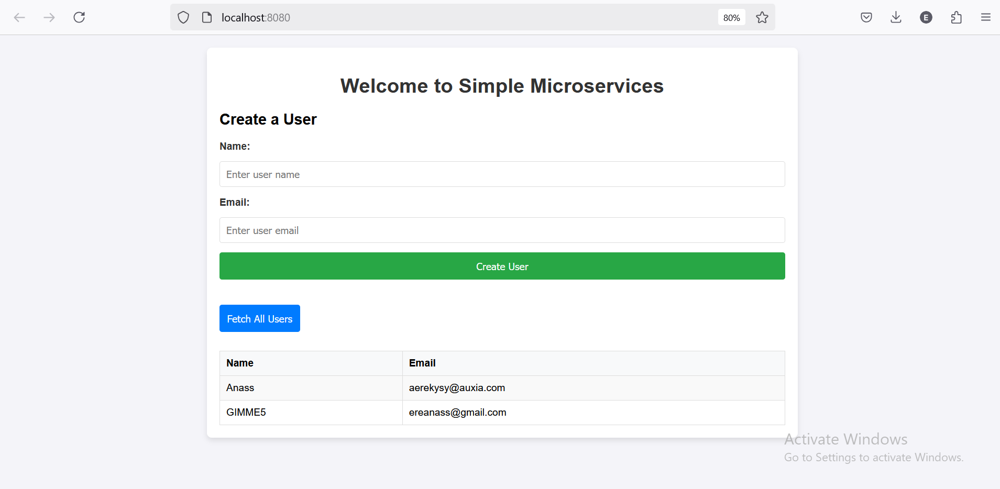
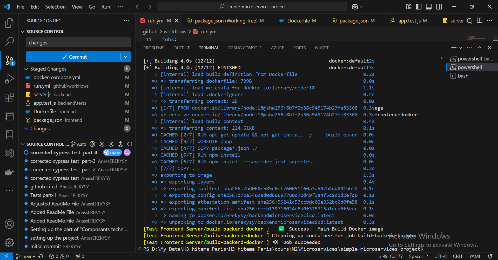

# Simple Microservices Project

This project is a simple microservices-based application built with a frontend and backend using Docker containers. The backend is built using Node.js with Express, and the frontend uses plain HTML and JavaScript. The project uses PostgreSQL as the database to store user data.

## Project Structure

The project contains the following main components:
1. **Frontend**: A simple user interface where users can submit a form to create new users and fetch a list of users.
2. **Backend**: An API built with Node.js and Express that handles requests from the frontend and communicates with the PostgreSQL database.
3. **Database**: A PostgreSQL database to store user information such as name and email.

## The project's interface

Below is the project's interface :



The components of the architecture are:
1. **Frontend (Port 8080)**: This is the client-side application that interacts with the backend. It includes a form for submitting user data and a button to fetch all users.
2. **Backend (Port 3000)**: This is the server-side application that exposes API endpoints to create and fetch users.
3. **Database (Port 5432)**: A PostgreSQL database that stores user data.

### Components and Services:

1. **Frontend**:
   - Route: `/` (Home page)
   - Port: `8080`
   - Functionality: Displays a user form, allows data submission, and fetches the list of users.

2. **Backend**:
   - Route: `/api/users` (GET, POST)
   - Port: `3000`
   - Functionality: Handles HTTP requests to create new users and retrieve existing users from the database.

3. **Database**:
   - PostgreSQL
   - Port: `5432`
   - Functionality: Stores user data (name and email).

## Getting Started

This section will guide you through setting up and running the project locally, including the necessary prerequisites, build instructions, and how to interact with the application once it's up and running.

### Prerequisites

Before you can start the project, you need to have the following tools installed:

1. **Docker**: This is used to build and run the application containers.
   - Download and install Docker from the official website: [Docker Installation](https://www.docker.com/get-started)
   
2. **Docker Compose**: This tool is used to define and run multi-container Docker applications.
   - Follow the installation guide here: [Docker Compose Installation](https://docs.docker.com/compose/install/)

3. **Git**: This tool is required to clone the repository from GitHub.
   - Install Git from here: [Git Installation](https://git-scm.com/book/en/v2/Getting-Started-Installing-Git)

### Setting Up the Project

Once you have the prerequisites installed, follow these steps to get the project up and running.

1. **Clone the Repository**

   First, clone the project repository from GitHub:

   ```bash
   git clone https://github.com/AnassEREKYSY/simple-microservices-project.git
   ```

2. **Navigate to the Project Directory**

   ```bash
   cd simple-microservices-project
   ```

3. **Build and Start the Containers**

   ```bash
   docker-compose up --build
   ```

4. **Wait for the Containers to Start**
    Docker Compose will download any required images and build your project containers. You will see logs in the terminal. Wait for the logs to show that all containers are up and running.

        - Frontend: The frontend will be accessible at http://localhost:8080.
        - Backend: The backend API will be accessible at http://localhost:3000.
        - Database: The PostgreSQL database will be running on port 5432 but won't need direct access for    regular usage.

### Interacting with the Application 

1. **Access the Frontend** 
    Open a browser and go to http://localhost:8080. You should see the frontend interface with the following features:

    A form to input a user’s name and email address.
    A button to fetch and display a list of users.

2. **Add a New User** 
    To add a user:

        Fill in the form with a name and email address.
        Click the Submit button. The backend will process the request and store the user in the PostgreSQL database.

    The form will reset, and the new user will be added to the list.

3. **View All Users**
To see the list of users:

    Click the Fetch Users button.
    The frontend will send a GET request to the backend, which will fetch all users from the database and display them in a table on the frontend.

4. **Backend API Endpoints**
    ```bash
    You can test the backend API directly using curl or Postman to interact with the following endpoints:
    GET /api/users: Fetch all users

        curl -X GET http://localhost:3000/api/users

    POST /api/users: Create a new user

        curl -X POST http://localhost:3000/api/users -H "Content-Type: application/json" -d '{"name": "John Doe", "email": "john@example.com"}'

    The backend will respond with user data in JSON format for both requests.
   ```

### Stopping the Containers
   ```bash
      docker-compose down
   ```

### act success command 
   ```bash
      act 
   ```
